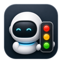
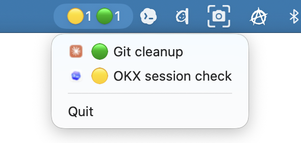

<p align="center">
  
</p>

# Agent Signals

If you, like me, work with Claude Code and Codex agents in iTerm, you'll find this app
useful. I built Agent Signals because terminal notifications are easy to miss while I am
deep in work (on calls, in meetings, etc.). When an AI coding agent waits for input,
approval, or a quick review, almost every missed prompt becomes idle time. Agent Signals
keeps a small traffic light in the macOS menu bar, so I can always see which agent is
working, which one has finished, and which one needs my attention.

<p align="center">
  
</p>

Agent Signals is a small macOS menu bar app for people who run AI coding agents in
iTerm. It turns silent agent state changes into a compact traffic-light indicator and
lets you focus the relevant iTerm tab from the menu.

```
🔴2 🟡3 🟢1 ⚠️1      💤 = no visible terminal sessions
```

## What It Shows

| Signal | Meaning |
|--------|---------|
| 🔴 | Waiting for your input or approval |
| 🟡 | Agent is working |
| 🟢 | Agent finished; your turn |
| ⚠️ | Agent was working, but the tracked process died |

The menu lists active Claude Code and Codex terminal sessions, shows the agent logo,
uses the live iTerm session title when available, and focuses the tab when clicked.

## Features

- Menu bar traffic-light counters for waiting, working, finished, and failed sessions.
- Dropdown session list with Claude Code and Codex icons.
- Live iTerm session titles in the session list, matching what the tab shows right now,
  including renames after the agent starts.
- One-click focus for the relevant iTerm tab.
- Local JSON status pipeline under `~/.claude/agent-traffic/`.
- Automatic cleanup for closed tabs, duplicate session records, stale work, and dead
  agent processes.
- Terminal-only filtering, so Codex Desktop and non-iTerm hook events do not pollute the
  signal.
- Local-only operation with no telemetry or remote status uploads.
- Developer ID notarized direct-download release flow for public distribution.

## Requirements

- macOS
- iTerm2
- Claude Code and/or Codex terminal sessions
- `jq` for the hook script
- Xcode only if you build from source

Codex Desktop is intentionally ignored: it is not an iTerm tab and does not expose
`ITERM_SESSION_ID`.

## Install

This is the only section most users need.

Download the latest notarized `AgentSignals.zip` from
[GitHub Releases](https://github.com/schmel007/AgentTrafficLight/releases/latest), unzip
it, move `Agent Signals.app` to `/Applications`, then open it.

You do not need Xcode, Apple Developer Program membership, Developer ID certificates, or
notarization credentials to install and use a published release.

On first focus or tab-title refresh, macOS asks for Automation permission to control
iTerm. Allow it in System Settings → Privacy & Security → Automation.

To launch at login, add `/Applications/Agent Signals.app` in System Settings → General
→ Login Items.

## Hook Setup

Agent Signals reads JSON files from:

```text
~/.claude/agent-traffic/
```

The producer is [hooks/agent-status.sh](hooks/agent-status.sh). It accepts:

```bash
hooks/agent-status.sh <working|waiting|done|end> [claude|codex]
```

Expected hook mapping:

| Agent | Event | State |
|-------|-------|-------|
| Claude Code | `UserPromptSubmit`, `PostToolUse` | `working` |
| Claude Code | `PermissionRequest` | `waiting` |
| Claude Code | `Stop` | `done` |
| Claude Code | `SessionEnd` | `end` |
| Codex terminal | `UserPromptSubmit` | `working` |
| Codex terminal | `Stop` | `done` |

Each status file contains `session_id`, `state`, `pid`, `ts`, `agent`, `cwd`, and
`iterm`. Writes are atomic: temporary file plus `mv`.

## Build

```bash
sh hooks/test_agent-status.sh
xcodebuild test \
  -project AgentTrafficLight/AgentTrafficLight.xcodeproj \
  -scheme AgentTrafficLight \
  -destination 'platform=macOS' \
  -only-testing:AgentTrafficLightTests
xcodebuild build \
  -project AgentTrafficLight/AgentTrafficLight.xcodeproj \
  -scheme AgentTrafficLight \
  -configuration Release
```

The internal Xcode target, scheme, executable, and bundle identifier still use
`AgentTrafficLight`. The public app name is `Agent Signals`.

App Sandbox is intentionally disabled because the app reads hook output under
`~/.claude/agent-traffic/` and uses Apple Events to inspect and focus iTerm tabs.
Distribution is via Developer ID notarized direct download, not the Mac App Store.

## Release

This section is for maintainers who build and publish a signed release. It is not needed
to install Agent Signals on a Mac.

The release script archives, exports with Developer ID, submits to Apple notarization,
staples the ticket, validates with Gatekeeper, and creates `dist/AgentSignals.zip`.

First, store notarization credentials in Keychain:

```bash
xcrun notarytool store-credentials AgentSignalsNotary \
  --apple-id "APPLE_ID_EMAIL" \
  --team-id "TEAM_ID" \
  --password "APP_SPECIFIC_PASSWORD"
```

Then run:

```bash
scripts/release.sh --preflight
scripts/release.sh
```

Useful overrides:

```bash
TEAM_ID=YOUR_TEAM_ID NOTARY_PROFILE=AgentSignalsNotary scripts/release.sh
```

More details: [docs/RELEASE.md](docs/RELEASE.md).

## Documentation

- [Architecture](docs/ARCHITECTURE.md)
- [Release process](docs/RELEASE.md)
- [Privacy](docs/PRIVACY.md)
- [Security](SECURITY.md)
- [Changelog](CHANGELOG.md)

## Known Limits

- Codex terminal has no waiting/approval hook, so Codex shows only 🟡, 🟢, and ⚠️.
- Codex terminal has no `SessionEnd`; closed Codex tabs are cleaned by iTerm GUID checks,
  TTL, or internal cleanup.
- iTerm session titles are best effort. If Automation is denied or iTerm is slow, the menu
  falls back to the project directory name.
- Long-running single tools without hook activity for more than one hour may be dropped
  from 🟡 to avoid stale process-id ghosts.
- Finished sessions stay visible while their terminal tab is still open.

## License

MIT. See [LICENSE](LICENSE).
